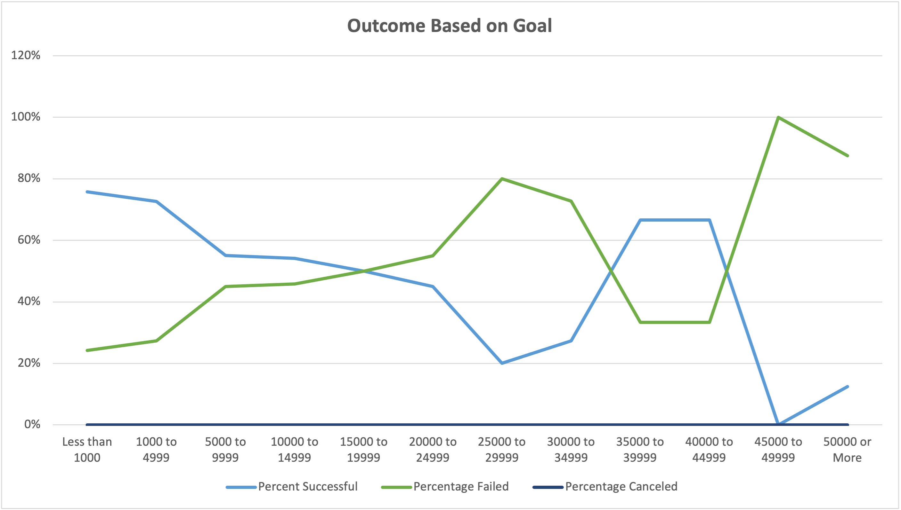

# Kickstarter Analysis

## Overview of Project
  The purpose of this analysis was to reveal the outcomes of several kickstarter campaigns based on their monetary goals and what date the campaign was launched. Our hypothetical client was starting a theater play and wanted to see how other theater kickstarters performed and if there were any insights that would help her in her campaign.
  

## Analysis and Challenges
  
#### Theater Outcomes by Launch Date
  To start my analysis, I created a pivot table on a seperate sheet titled "Theater Outcomes by Launch Date" that had months as rows, and the outcomes(successful, failed, canceled) as the columns. I then filtered it by the Parent Category set to theater so we can specifically see how well the theater campaigns performed based on the month that the kickstarter was launched. Below is an image that represents the Pivot Table.
 

This line chart shows the count of kickstarters on the y-axis and the months on the x-axis. As we can see, in May there is a spike of successful kickstarter campaigns that slowly declines. This may point to advising our client to start their kickstarter in May, or in the summer. From September to November, there is a mini spike of failed kickstarters, while the amount of successful kickstarters declines. We can advise our client to avoid starting a kickstarter in autumn and winter due to a possible chance that it is less likely to succeed when compared to the odds of starting a successful campaign at the beginning of summer.

#### Outcomes Based on Goals
I created another sheet to hold a table with ascending ranges of campaigns goals as rows, and the count and percentages of the number of successful, canceled, and failed projects, filtered by the subcategory "plays". Here is where I ran into a little challenge of using the "=COUNTIFS()" function. It was just a little tedious because I couldn't apply the same function to all the rows, I had to edit the function for row in the columns, Number Successful, Number Failed, and Number Canceled. I then created a Total Projects column using the "=SUM()" function, and used that to calculate percentages. Below is an image that represents the data gathered here.

In this line chart, the y-axis represents percentages, and the x-axis represents the ranges of goals selected. The blue line is the percent of successful campaigns, while the green line is the percent of failed campaigns. There is no third line because there weren't any canceled plays. As we can see from this chart, the most successful campaigns were <1000 to ~5000.

## Results
#### Theater Outcomes by Launch Date conclusions
The "Theater Outcomes by Launch Date" chart shows us that the best time to start theater campaign would be the start of summer, or May/June. This chart also shows us that the worst time to start a theater campaign would be in December, or Autumn, as the amount failed spikes around that time. 

#### Outcomes Based on Goals conclusions
The "Outcomes Based on Goals" chart shows us that the most ranges with the most success would be <1000 to 4000 or 5000. There is a total of 703 campaigns in those ranges that had a 70%~ success rate. Although it seems that the 35000-45000 range was also fairly successful, there were only a total of 9 campaigns. It seems that as the goal amount rises, the general trend is that the percentage of success drops.

#### Limitations of the Dataset
Some limitations of this data is just the fact that we don't know how these campaigns look at all. Their marketing could look completely different which could be a huge factor in seeing why some campaigns are successful and some aren't. Some of the campaigns could be very poorly visually presented in kickstarter, while others look amazing. Whatever the case may be, this data does not show that. 

#### Possible tables and charts
In this analysis, I used the Parent Category filter to only show us "theater outcomes based on launch date". To do more specific analysis, I could also filter by subcategory to make a "play outcomes based on launch date" chart.

