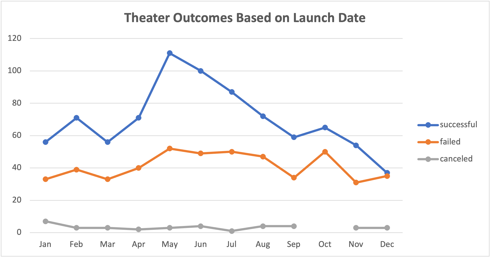

# Kickstarter Analysis

## Overview of Project
  The purpose of this analysis was to reveal the outcomes of several kickstarter campaigns based on their monetary goals and what date the campaign was launched. Our hypothetical client was starting a theater play and wanted to see how other theater kickstarters performed and if there were any insights that would help her in her campaign.
  

## Analysis and Challenges
  To start my analysis, I created a pivot table on a seperate sheet titled "Theater Outcomes by Launch Date" that had months as rows, and the outcomes(successful, failed, canceled) as the columns. I then filtered it by the Parent Category set to theater so we can specifically see how well the theater campaigns performed based on the month that the kickstarter was launched. Below is an image that represents the Pivot Table.
 

This line chart shows the count of kickstarters on the y-axis and the months on the x-axis. As we can see, in May there is a spike of successful kickstarter campaigns that slowly declines. This may point to advising our client to start their kickstarter in May, or in the summer. From September to November, there is a mini spike of failed kickstarters, while the amount of successful kickstarters declines. We can advise our client to avoid starting a kickstarter in autumn and winter due to a possible chance that it is less likely to succeed when compared to the odds of starting a successful campaign at the beginning of summer.

After that, I created another sheet to hold a table with ascending ranges of campaigns goals as rows, and the count and percentages of the number of successful, canceled, and failed projects. Here is where I ran into a little challenge of using the "=COUNTIFS()" function. It was just a little tedious because I couldn't apply the same function to all the rows, I had to edit the function for row in the columns, Number Successful, Number Failed, and Number Canceled. I then created a Total Projects column using the "=SUM()" function, and used that to calculate percentages. Below is an image that represents the data gathered here.

